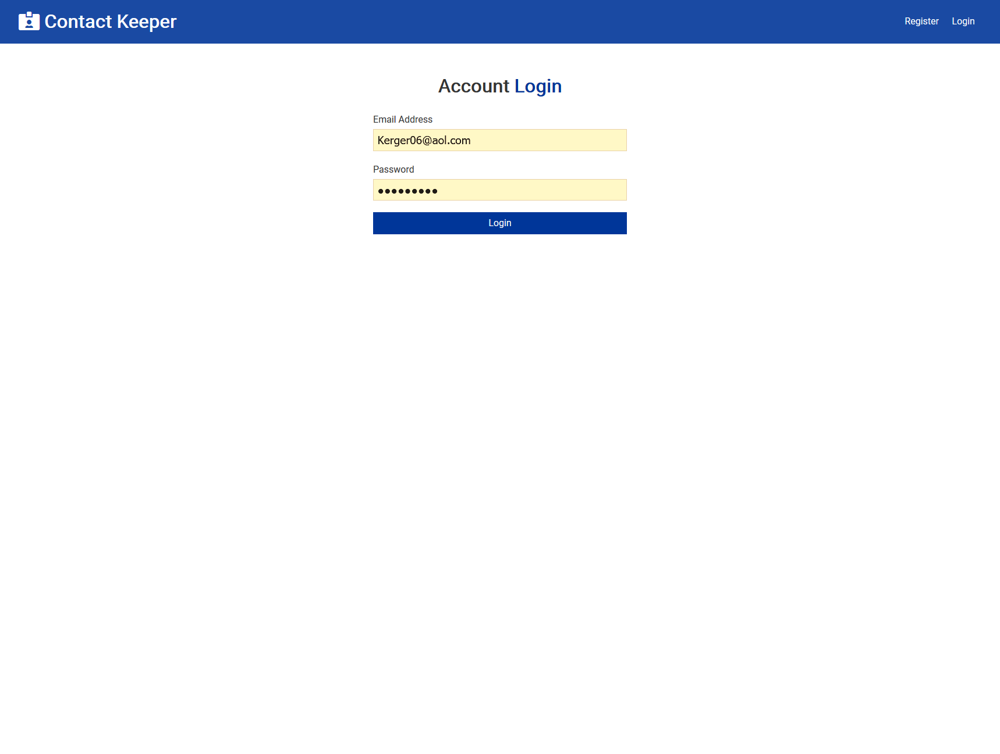
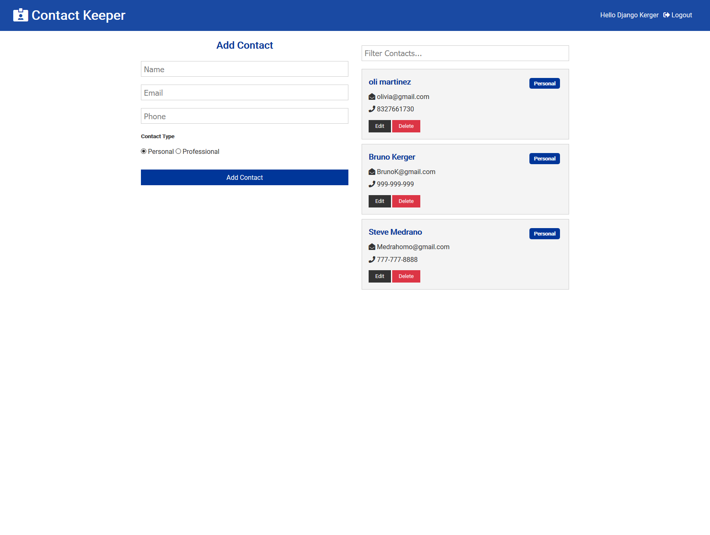
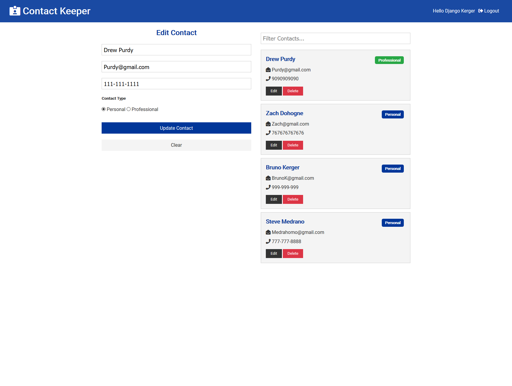
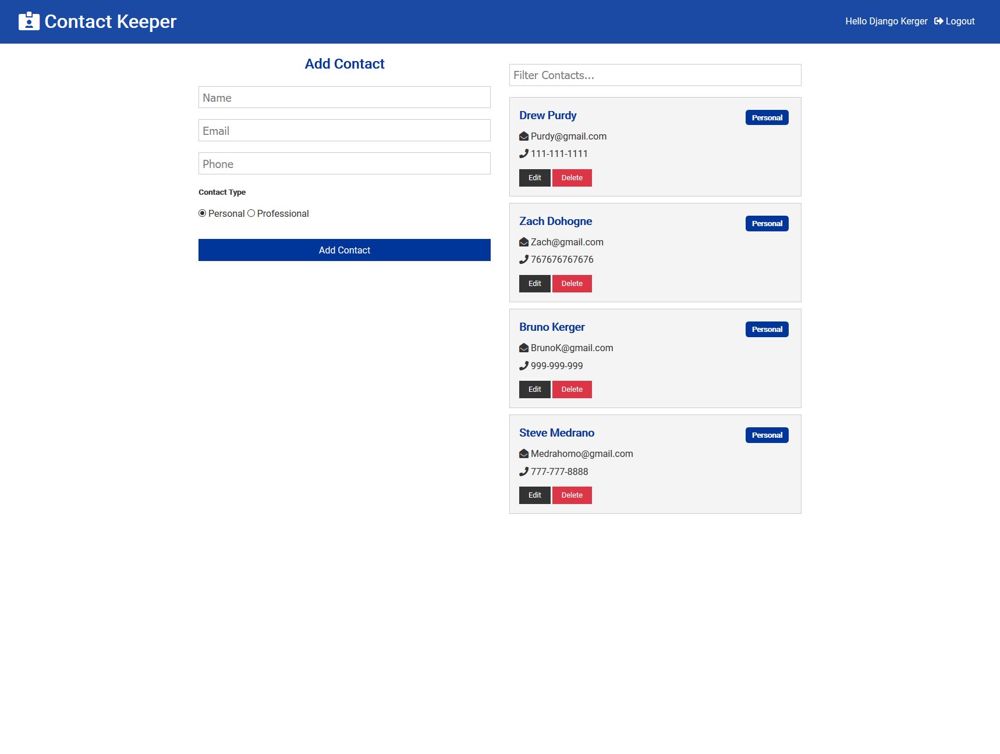

<h1>Using Reactjs for the front end, MongoDB for the database, Node/express for the server, and guidance from Traversy media I have created this contact keeper.   </h1>

<a href = "https://mysterious-refuge-07031.herokuapp.com/login">          <h1>Full Site</h1></a>

<h2>Users will log in, or if not registered, register an account. Passwords are encrypted and a webtoken is issued in order to see the that specific users contacts.</h2>

<h1> My contacts after I logged in.</h1>

<h1>From here I can search for a specific contact.</h1>

<h1>I can also add new contacts.</h1>

<h1>Edit existing contacts</h1>

<h3> here I am updating a contacts phone number and type of contact from proffesional to personal.<h3>

<h1>Most importantly routes are protected and every registered user is only allowed to see their own contacts as well as preventing anyone else from seeing theirs.</h1>

